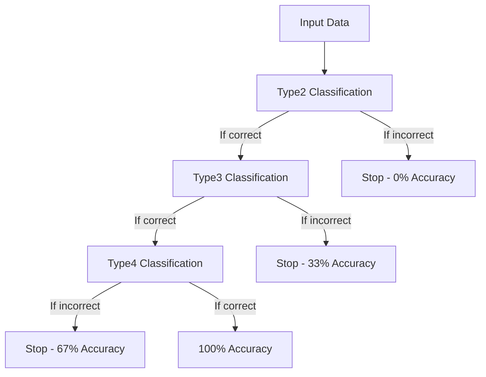
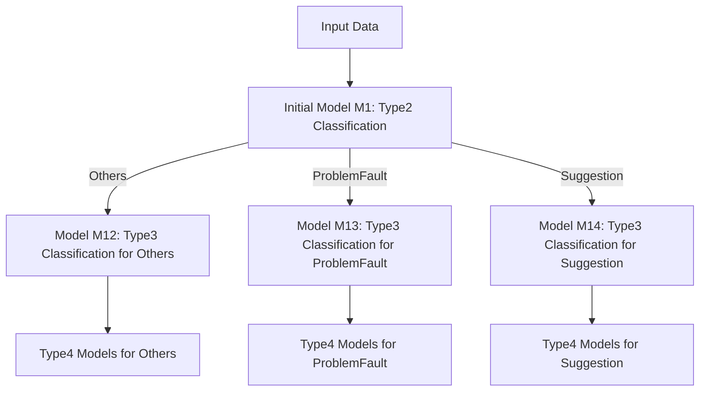
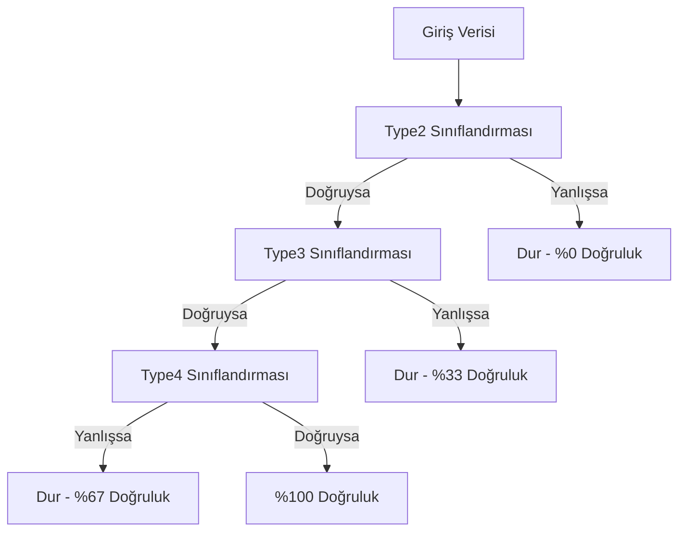
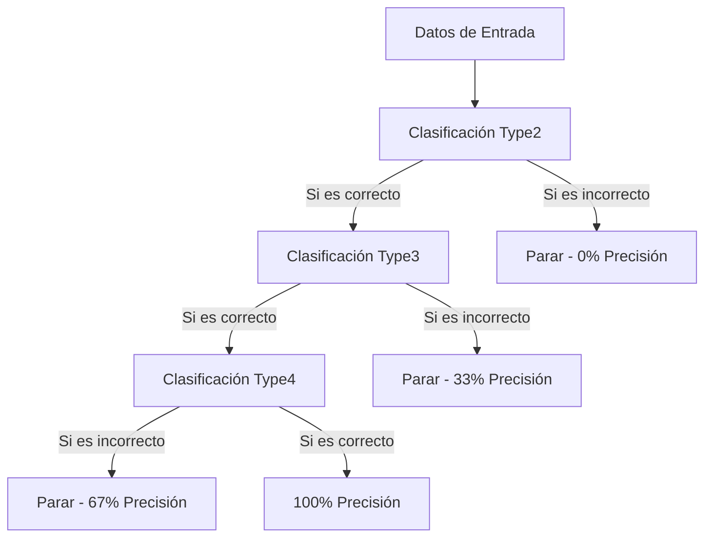
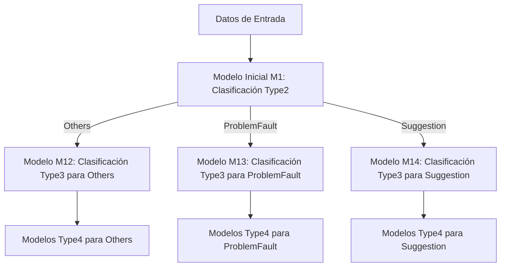

# 
JOSE ALBERTO CRUZ SANCHEZ (x23191236)

EMIN CEM  KOYLUOGLU (x23192542)


---

# [English](#english) | [Türkçe](#turkish) | [Español](#spanish)

<a id="english"></a>

# Chained and Hierarchical Classification Tasks

## Project Overview

This project implements and evaluates two advanced text classification approaches that handle complex classification scenarios: Chained Multi-outputs and Hierarchical Modeling. These techniques are designed for cases where classification categories have dependencies or hierarchical relationships.

Project Structure Diagram

## Task 1: Chained Multi-outputs Classification

**Objective:** Develop and evaluate a classification model where the accuracy depends on correct predictions in a specific sequence (Type2 → Type3 → Type4).

### Methodology

The classification process follows a chained dependency model:



* **Type2 Classification**: The first level classification must be correctly predicted before proceeding
* **Type3 Classification**: Can only be evaluated if Type2 is correctly predicted
* **Type4 Classification**: Can only be evaluated if both Type2 and Type3 are correctly predicted


### Evaluation Process

The evaluation follows a weighted scheme based on the dependency chain:


| Prediction Outcome | Accuracy Score |
| :-- | :-- |
| Type2 Incorrect | 0% |
| Type2 Correct, Type3 Incorrect | 33% |
| Type2 Correct, Type3 Correct, Type4 Incorrect | 67% |
| All Types Correct | 100% |

#### Example Evaluation

To illustrate the evaluation process:


| Instance | Type2 | Type3 | Type4 | Accuracy Calculation |
| :-- | :-- | :-- | :-- | :-- |
| Instance 1 | ✓ | ✓ | ✓ | 100% (all correct) |
| Instance 2 | ✓ | ✗ | - | 33% (Type2 correct, Type3 wrong) |
| Instance 3 | ✗ | - | - | 0% (Type2 wrong) |
| Instance 4 | ✓ | ✓ | ✗ | 67% (Type2 and Type3 correct, Type4 wrong) |

Final system accuracy is calculated by averaging individual instance accuracies.

## Task 2: Hierarchical Modeling

**Objective:** Implement a multi-stage classification approach where each stage filters data for subsequent models based on previous predictions.

### Methodology

This approach uses a tree-like structure of specialized models:



1. **First Level (M1):** Classifies all data into Type2 categories (Others, ProblemFault, Suggestion)
2. **Second Level (M12, M13, M14):** Specialized models for Type3 classification, each trained on specific Type2 subset
3. **Third Level:** Specialized models for Type4 classification, trained on specific Type2 and Type3 combinations

### Evaluation Process

The hierarchical model is evaluated based on the correctness of the classification path:


| Classification Path | Score |
| :-- | :-- |
| Perfect path (all stages correct) | Full score (100%) |
| Type2 correct, Type3 incorrect | Partial credit (depends on implementation) |
| Type2 incorrect | Zero score (0%) |

## Implementation Details

### Data Processing

1. **Data Splitting**:
    - Training data (70%)
    - Validation data (15%)
    - Test data (15%)
2. **Feature Engineering**:
    - Text preprocessing (cleaning, normalization)
    - Feature extraction (TF-IDF, word embeddings)
    - Feature selection methods

### Model Architecture

#### Chained Model Implementation

```python
# Pseudocode for Chained Model Implementation
class ChainedClassifier:
    def __init__(self, models):
        self.type2_model = models[^0]
        self.type3_model = models[^1]
        self.type4_model = models[^2]
    
    def predict(self, X):
        type2_pred = self.type2_model.predict(X)
        type3_pred = self.type3_model.predict(X)
        type4_pred = self.type4_model.predict(X)
        return type2_pred, type3_pred, type4_pred
    
    def evaluate(self, X, y_true):
        type2_pred, type3_pred, type4_pred = self.predict(X)
        # Evaluate based on chained dependency logic
        # Return accuracy scores
```


#### Hierarchical Model Implementation

```python
# Pseudocode for Hierarchical Model Implementation
class HierarchicalClassifier:
    def __init__(self, models):
        self.M1 = models['type2']
        self.M12 = models['type3_others']
        self.M13 = models['type3_problem']
        self.M14 = models['type3_suggestion']
        self.type4_models = models['type4']
    
    def predict(self, X):
        type2_pred = self.M1.predict(X)
        
        # Apply specialized models based on Type2 prediction
        type3_preds = []
        type4_preds = []
        
        for i, pred in enumerate(type2_pred):
            if pred == "Others":
                type3_pred = self.M12.predict([X[i]])
            elif pred == "ProblemFault":
                type3_pred = self.M13.predict([X[i]])
            elif pred == "Suggestion":
                type3_pred = self.M14.predict([X[i]])
                
            type3_preds.append(type3_pred)
            
            # Apply Type4 model
            type4_model_key = f"type4_{pred}_{type3_pred}"
            if type4_model_key in self.type4_models:
                type4_pred = self.type4_models[type4_model_key].predict([X[i]])
                type4_preds.append(type4_pred)
                
        return type2_pred, type3_preds, type4_preds
```


## Technical Requirements

- Python 3.7+
- Required libraries:
    - scikit-learn
    - pandas
    - numpy
    - matplotlib
    - tensorflow/keras (for deep learning models)
- Computing resources:
    - Minimum 8GB RAM
    - GPU recommended for deep learning models


## Getting Started

1. **Installation**:

```bash
git clone https://github.com/username/chained-hierarchical-classification.git
cd chained-hierarchical-classification
pip install -r requirements.txt
```

2. **Training Models**:

```bash
python train.py --model chained --data path/to/data
python train.py --model hierarchical --data path/to/data
```

3. **Evaluation**:

```bash
python evaluate.py --model chained --test path/to/test_data
python evaluate.py --model hierarchical --test path/to/test_data
```

4. **Visualization**:

```bash
python visualize.py --results path/to/results
```


<a id="turkish"></a>

# Zincirli ve Hiyerarşik Sınıflandırma Görevleri

## Proje Genel Bakışı

Bu proje, karmaşık sınıflandırma senaryolarını ele alan iki gelişmiş metin sınıflandırma yaklaşımını uygular ve değerlendirir: Zincirli Çoklu Çıktılar ve Hiyerarşik Modelleme. Bu teknikler, sınıflandırma kategorilerinin bağımlılıkları veya hiyerarşik ilişkileri olduğu durumlar için tasarlanmıştır.

Proje Yapısı Diyagramı

## Görev 1: Zincirli Çoklu Çıktılar Sınıflandırması

**Amaç:** Doğruluğun belirli bir sıradaki doğru tahminlere bağlı olduğu (Type2 → Type3 → Type4) bir sınıflandırma modeli geliştirmek ve değerlendirmek.

### Metodoloji

Sınıflandırma süreci zincirli bir bağımlılık modelini takip eder:



* **Type2 Sınıflandırması**: İlk seviye sınıflandırma, devam etmeden önce doğru tahmin edilmelidir
* **Type3 Sınıflandırması**: Yalnızca Type2 doğru tahmin edilirse değerlendirilebilir
* **Type4 Sınıflandırması**: Yalnızca hem Type2 hem de Type3 doğru tahmin edilirse değerlendirilebilir


### Değerlendirme Süreci

Değerlendirme, bağımlılık zincirine dayalı ağırlıklı bir şemayı takip eder:


| Tahmin Sonucu | Doğruluk Puanı |
| :-- | :-- |
| Type2 Yanlış | %0 |
| Type2 Doğru, Type3 Yanlış | %33 |
| Type2 Doğru, Type3 Doğru, Type4 Yanlış | %67 |
| Tüm Türler Doğru | %100 |

#### Örnek Değerlendirme

Değerlendirme sürecini göstermek için:


| Örnek | Type2 | Type3 | Type4 | Doğruluk Hesaplaması |
| :-- | :-- | :-- | :-- | :-- |
| Örnek 1 | ✓ | ✓ | ✓ | %100 (hepsi doğru) |
| Örnek 2 | ✓ | ✗ | - | %33 (Type2 doğru, Type3 yanlış) |
| Örnek 3 | ✗ | - | - | %0 (Type2 yanlış) |
| Örnek 4 | ✓ | ✓ | ✗ | %67 (Type2 ve Type3 doğru, Type4 yanlış) |

Final sistem doğruluğu, bireysel örnek doğruluklarının ortalaması alınarak hesaplanır.

## Görev 2: Hiyerarşik Modelleme

**Amaç:** Her aşamanın önceki tahminlere dayanarak sonraki modeller için verileri filtrelediği çok aşamalı bir sınıflandırma yaklaşımı uygulamak.

### Metodoloji

Bu yaklaşım, özelleştirilmiş modellerin ağaç benzeri bir yapısını kullanır:


1. **Birinci Seviye (M1):** Tüm verileri Type2 kategorilerine sınıflandırır (Others, ProblemFault, Suggestion)
2. **İkinci Seviye (M12, M13, M14):** Type3 sınıflandırması için özelleştirilmiş modeller, her biri belirli Type2 alt kümesi üzerinde eğitilmiştir
3. **Üçüncü Seviye:** Type4 sınıflandırması için özelleştirilmiş modeller, belirli Type2 ve Type3 kombinasyonları üzerinde eğitilmiştir

### Değerlendirme Süreci

Hiyerarşik model, sınıflandırma yolunun doğruluğuna göre değerlendirilir:


| Sınıflandırma Yolu | Puan |
| :-- | :-- |
| Mükemmel yol (tüm aşamalar doğru) | Tam puan (%100) |
| Type2 doğru, Type3 yanlış | Kısmi kredi (uygulamaya bağlı) |
| Type2 yanlış | Sıfır puan (%0) |

## Uygulama Detayları

### Veri İşleme

1. **Veri Bölünmesi**:
    - Eğitim verisi (%70)
    - Doğrulama verisi (%15)
    - Test verisi (%15)
2. **Özellik Mühendisliği**:
    - Metin ön işleme (temizleme, normalleştirme)
    - Özellik çıkarma (TF-IDF, kelime gömmeleri)
    - Özellik seçim yöntemleri

### Model Mimarisi

#### Zincirli Model Uygulaması

```python
# Zincirli Model Uygulaması için Sözde Kod
class ZincirliSiniflandirici:
    def __init__(self, modeller):
        self.type2_modeli = modeller[^0]
        self.type3_modeli = modeller[^1]
        self.type4_modeli = modeller[^2]
    
    def tahmin_et(self, X):
        type2_tahmin = self.type2_modeli.predict(X)
        type3_tahmin = self.type3_modeli.predict(X)
        type4_tahmin = self.type4_modeli.predict(X)
        return type2_tahmin, type3_tahmin, type4_tahmin
    
    def degerlendir(self, X, y_gercek):
        type2_tahmin, type3_tahmin, type4_tahmin = self.tahmin_et(X)
        # Zincirli bağımlılık mantığına göre değerlendir
        # Doğruluk puanlarını döndür
```


#### Hiyerarşik Model Uygulaması

```python
# Hiyerarşik Model Uygulaması için Sözde Kod
class HiyerarsikSiniflandirici:
    def __init__(self, modeller):
        self.M1 = modeller['type2']
        self.M12 = modeller['type3_others']
        self.M13 = modeller['type3_problem']
        self.M14 = modeller['type3_suggestion']
        self.type4_modelleri = modeller['type4']
    
    def tahmin_et(self, X):
        type2_tahmin = self.M1.predict(X)
        
        # Type2 tahminine göre özelleştirilmiş modelleri uygula
        type3_tahminler = []
        type4_tahminler = []
        
        for i, tahmin in enumerate(type2_tahmin):
            if tahmin == "Others":
                type3_tahmin = self.M12.predict([X[i]])
            elif tahmin == "ProblemFault":
                type3_tahmin = self.M13.predict([X[i]])
            elif tahmin == "Suggestion":
                type3_tahmin = self.M14.predict([X[i]])
                
            type3_tahminler.append(type3_tahmin)
            
            # Type4 modelini uygula
            type4_model_anahtar = f"type4_{tahmin}_{type3_tahmin}"
            if type4_model_anahtar in self.type4_modelleri:
                type4_tahmin = self.type4_modelleri[type4_model_anahtar].predict([X[i]])
                type4_tahminler.append(type4_tahmin)
                
        return type2_tahmin, type3_tahminler, type4_tahminler
```


## Teknik Gereksinimler

- Python 3.7+
- Gerekli kütüphaneler:
    - scikit-learn
    - pandas
    - numpy
    - matplotlib
    - tensorflow/keras (derin öğrenme modelleri için)
- Hesaplama kaynakları:
    - Minimum 8GB RAM
    - Derin öğrenme modelleri için GPU önerilir


## Başlangıç

1. **Kurulum**:

```bash
git clone https://github.com/kullaniciadi/zincirli-hiyerarsik-siniflandirma.git
cd zincirli-hiyerarsik-siniflandirma
pip install -r requirements.txt
```

2. **Modelleri Eğitme**:

```bash
python train.py --model zincirli --data veri/yolu
python train.py --model hiyerarsik --data veri/yolu
```

3. **Değerlendirme**:

```bash
python evaluate.py --model zincirli --test test_veri/yolu
python evaluate.py --model hiyerarsik --test test_veri/yolu
```

4. **Görselleştirme**:

```bash
python visualize.py --results sonuclar/yolu
```


<a id="spanish"></a>

# Tareas de Clasificación Encadenada y Jerárquica

## Descripción General del Proyecto

Este proyecto implementa y evalúa dos enfoques avanzados de clasificación de texto que manejan escenarios de clasificación complejos: Salidas Múltiples Encadenadas y Modelado Jerárquico. Estas técnicas están diseñadas para casos donde las categorías de clasificación tienen dependencias o relaciones jerárquicas.

Diagrama de Estructura del Proyecto

## Tarea 1: Clasificación de Salidas Múltiples Encadenadas

**Objetivo:** Desarrollar y evaluar un modelo de clasificación donde la precisión depende de predicciones correctas en una secuencia específica (Type2 → Type3 → Type4).

### Metodología

El proceso de clasificación sigue un modelo de dependencia encadenada:



* **Clasificación Type2**: La clasificación de primer nivel debe ser predicha correctamente antes de continuar
* **Clasificación Type3**: Solo puede evaluarse si Type2 se predice correctamente
* **Clasificación Type4**: Solo puede evaluarse si tanto Type2 como Type3 se predicen correctamente


### Proceso de Evaluación

La evaluación sigue un esquema ponderado basado en la cadena de dependencia:


| Resultado de Predicción | Puntuación de Precisión |
| :-- | :-- |
| Type2 Incorrecto | 0% |
| Type2 Correcto, Type3 Incorrecto | 33% |
| Type2 Correcto, Type3 Correcto, Type4 Incorrecto | 67% |
| Todos los Tipos Correctos | 100% |

#### Ejemplo de Evaluación

Para ilustrar el proceso de evaluación:


| Instancia | Type2 | Type3 | Type4 | Cálculo de Precisión |
| :-- | :-- | :-- | :-- | :-- |
| Instancia 1 | ✓ | ✓ | ✓ | 100% (todos correctos) |
| Instancia 2 | ✓ | ✗ | - | 33% (Type2 correcto, Type3 incorrecto) |
| Instancia 3 | ✗ | - | - | 0% (Type2 incorrecto) |
| Instancia 4 | ✓ | ✓ | ✗ | 67% (Type2 y Type3 correctos, Type4 incorrecto) |

La precisión final del sistema se calcula promediando las precisiones de instancias individuales.

## Tarea 2: Modelado Jerárquico

**Objetivo:** Implementar un enfoque de clasificación multi-etapa donde cada etapa filtra datos para modelos subsiguientes basados en predicciones previas.

### Metodología

Este enfoque utiliza una estructura de árbol de modelos especializados:



1. **Primer Nivel (M1):** Clasifica todos los datos en categorías Type2 (Others, ProblemFault, Suggestion)
2. **Segundo Nivel (M12, M13, M14):** Modelos especializados para clasificación Type3, cada uno entrenado en subconjunto específico de Type2
3. **Tercer Nivel:** Modelos especializados para clasificación Type4, entrenados en combinaciones específicas de Type2 y Type3

### Proceso de Evaluación

El modelo jerárquico se evalúa basado en la corrección de la ruta de clasificación:


| Ruta de Clasificación | Puntuación |
| :-- | :-- |
| Ruta perfecta (todas las etapas correctas) | Puntuación completa (100%) |
| Type2 correcto, Type3 incorrecto | Crédito parcial (depende de la implementación) |
| Type2 incorrecto | Puntuación cero (0%) |

## Detalles de Implementación

### Procesamiento de Datos

1. **División de Datos**:
    - Datos de entrenamiento (70%)
    - Datos de validación (15%)
    - Datos de prueba (15%)
2. **Ingeniería de Características**:
    - Preprocesamiento de texto (limpieza, normalización)
    - Extracción de características (TF-IDF, incrustaciones de palabras)
    - Métodos de selección de características

### Arquitectura del Modelo

#### Implementación del Modelo Encadenado

```python
# Pseudocódigo para Implementación de Modelo Encadenado
class ClasificadorEncadenado:
    def __init__(self, modelos):
        self.modelo_type2 = modelos[^0]
        self.modelo_type3 = modelos[^1]
        self.modelo_type4 = modelos[^2]
    
    def predecir(self, X):
        pred_type2 = self.modelo_type2.predict(X)
        pred_type3 = self.modelo_type3.predict(X)
        pred_type4 = self.modelo_type4.predict(X)
        return pred_type2, pred_type3, pred_type4
    
    def evaluar(self, X, y_verdadero):
        pred_type2, pred_type3, pred_type4 = self.predecir(X)
        # Evaluar basado en lógica de dependencia encadenada
        # Retornar puntuaciones de precisión
```


#### Implementación del Modelo Jerárquico

```python
# Pseudocódigo para Implementación de Modelo Jerárquico
class ClasificadorJerarquico:
    def __init__(self, modelos):
        self.M1 = modelos['type2']
        self.M12 = modelos['type3_others']
        self.M13 = modelos['type3_problem']
        self.M14 = modelos['type3_suggestion']
        self.modelos_type4 = modelos['type4']
    
    def predecir(self, X):
        pred_type2 = self.M1.predict(X)
        
        # Aplicar modelos especializados basados en predicción Type2
        preds_type3 = []
        preds_type4 = []
        
        for i, pred in enumerate(pred_type2):
            if pred == "Others":
                pred_type3 = self.M12.predict([X[i]])
            elif pred == "ProblemFault":
                pred_type3 = self.M13.predict([X[i]])
            elif pred == "Suggestion":
                pred_type3 = self.M14.predict([X[i]])
                
            preds_type3.append(pred_type3)
            
            # Aplicar modelo Type4
            clave_modelo_type4 = f"type4_{pred}_{pred_type3}"
            if clave_modelo_type4 in self.modelos_type4:
                pred_type4 = self.modelos_type4[clave_modelo_type4].predict([X[i]])
                preds_type4.append(pred_type4)
                
        return pred_type2, preds_type3, preds_type4
```


## Requisitos Técnicos

- Python 3.7+
- Bibliotecas requeridas:
    - scikit-learn
    - pandas
    - numpy
    - matplotlib
    - tensorflow/keras (para modelos de aprendizaje profundo)
- Recursos computacionales:
    - Mínimo 8GB RAM
    - Se recomienda GPU para modelos de aprendizaje profundo


## Primeros Pasos

1. **Instalación**:

```bash
git clone https://github.com/nombreusuario/clasificacion-encadenada-jerarquica.git
cd clasificacion-encadenada-jerarquica
pip install -r requirements.txt
```

2. **Entrenamiento de Modelos**:

```bash
python train.py --model encadenado --data ruta/a/datos
python train.py --model jerarquico --data ruta/a/datos
```

3. **Evaluación**:

```bash
python evaluate.py --model encadenado --test ruta/a/datos_prueba
python evaluate.py --model jerarquico --test ruta/a/datos_prueba
```

4. **Visualización**:

```bash
python visualize.py --results ruta/a/resultados
```


<div style="text-align: center">⁂</div>
